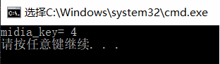

# Median of Two Sorted Arrays
There are two sorted arrays nums1 and nums2 of size m and n respectively.Find the median of the two sorted arrays. The overall run time complexity should be O(log(m+n)).  
**中位数的概念**  
 * 将一个集合划分为两个长度相等的子集，其中一个子集中的元素总是大于另一个子集中的元素。

**方法： 分治法 **

**算法分析**  
 * 将有序数组分成两部分，可以得到如下关系式:
```
 len(left_part)=len(right_part)   
 max(left_part)≤min(right_part)
```

left_part | right_part
--- | ---
A[0], A[1], ..., A[i-1]  |  A[i], A[i+1], ..., A[m-1]
B[0], B[1], ..., B[j-1]  |  B[j], B[j+1], ..., B[n-1]

 * 那么，中位数就是：  
$$median=[max(left\_part)+min(right\_part)] / 2 $$  

**代码如下：**
```cpp
int findMedianSortedArrays(int A[],int A_len, int B[],int B_len) {
  	int m=A_len,n=B_len;
  	int iMin = 0, iMax = m, halfLen = (m + n + 1) / 2;
  	while (iMin <= iMax) {
  		int i = (iMin + iMax) / 2;
  		int j = halfLen - i;
  		if (i < iMax && B[j-1] > A[i]){
  			iMin = i + 1; // i is too small,需要增大i，减小j
  		}
  		else if (i > iMin && A[i-1] > B[j]) {
  			iMax = i - 1; // i is too big,需要减小i，增大j
  		}
  		else { // i is perfect，i是临界值，0或者m
  		int maxLeft = 0;
  		if (i == 0) { maxLeft = B[j-1]; }
  		else if (j == 0) { maxLeft = A[i-1]; }
  		else { maxLeft = max(A[i-1], B[j-1]); }
  		if ( (m + n) % 2 == 1 ) { return maxLeft; }
  
  		int minRight = 0;
  		if (i == m) { minRight = B[j]; }
  		else if (j == n) { minRight = A[i]; }
  		else { minRight = min(B[j], A[i]); }
  
  		return (maxLeft + minRight) / 2;
  		}
  	}
}
```	
**运行结果:**  
　　*数组元素为:array1*[3] = {1,2,7};  *array2*[3] = {3,5,6};  
　　

**算法复杂度分析:**  
 * 时间复杂度：查找的区间是[0,m],每次循环之后，查找区间的长度都会降为原先的一半。所以，最多执行$$lg(m)$$次。
由于$$ m<=n $$,所以时间复杂度为$$ O(lg(min(m,n))) $$。

 

