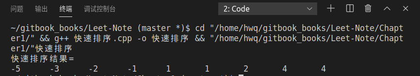
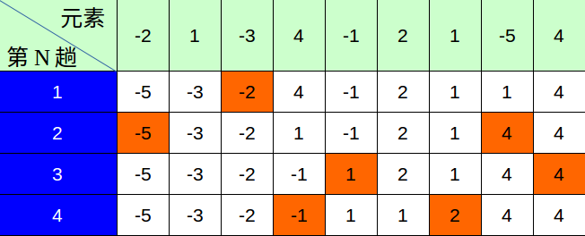

# 快速排序
**问题：**  
实现对数组int arr[9]={-2,1,-3,4,-1,2,1,-5,4}的快速排序，并画出流程图


**方法： 分治法 **

**快速排序原理：**  
* 任找一个元素作为基准，对待排数组进行分组  
* 使基准元素左边的数据都比基准元素小，右边的数据都比基准元素大。这样基准元素就放在了正确的位置上。  
* 然后对基准元素左边和右边的数据分组进行相同的操作，最后完成数组的排序。

**代码如下:**
```cpp
#include <iostream>
using std::cin;
using std::cout;
using std::endl;

int Partition(int arr[], int low, int high){
    int pivot_key=arr[low];//临时存储基准值
    while(low<high){
        while (low<high && arr[high]>=pivot_key)  --high;
        arr[low]=arr[high];
        while (low<high && arr[low]<=pivot_key)  ++low;
        arr[high]=arr[low];
    }
    arr[low]=pivot_key;//把基准值放到最后准确的位置
    return low;
}
void QuickSort(int arr[], int low, int high){
    int pivot;
    if(low<high){
        pivot=Partition(arr,low,high);
        QuickSort(arr,low,pivot-1);
        QuickSort(arr, pivot+1,high);
    }
}

int main(){
    int arr[9]={-2,1,-3,4,-1,2,1,-5,4};
    QuickSort(arr,0,8);
    cout<<"快速排序结果= "<<endl;
    for (char i = 0; i < 9; i++){
        cout<<arr[i]<<'\t';
    }
    cout<<endl;
    return 0;
}
```
**运行结果：**  


**快排流程图**  
　　　　  
**注:** *褐色的数字格表示此趟快排的基准值*

**算法复杂度分析:**  
时间复杂度：$$O(nlg(n))$$  
空间复杂度：$$O(lg(n))$$


