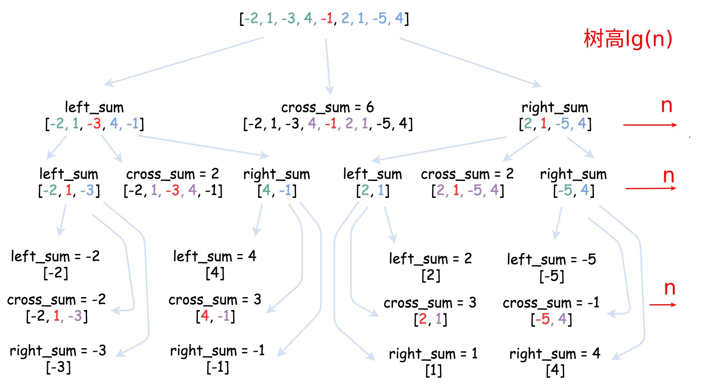

# 最大子序和
给定一个整数数组nums，找到一个具有最大和的连续子数组(子数组最少包含一个元素)，返回其最大和。  
** 示例 **:  
*输入*: [-2,1,-3,4,-1,2,1,-5,4]  
*输出*: `6`  
*解释*: 连续子数组 [4,-1,2,1] 的和最大为`6`


**方法： 分治法 **

**算法分析：**
1. 把数组分成左右两个子数组，最大自序和只可能出现在  
　1.左子数组   
　2.右子数组  
　3.横跨左右子数组的部分或全部元素   
2. 然后对左子数组或右子数组时，进一步拆分，依次循环，直至拆分的子数组中只有一个元素。
 * 拆分序列（直到只剩下一个数的数组）
 * 求左子数组最大值
 * 求右子数组最大值
 * 求横跨左右子数组的最大值
3. 合并，得出以上三个最大值的最大值
4. 当最大子数组有 $$n$$ 个数字时：
 * 若 $$n==1$$，返回此元素。
 * *left_sum* 是左子数组的元素之和最大值
 * *right_sum* 是右子数组的元素之和最大值
 * *cross_sum* 是横跨左右子数组元素之和的最大值

**代码如下:**
```cpp
    #include <iostream>
    using std::cout;
    using std::cin;
    using std::endl;
    int CrossSum(int nums[],int left, int right, int mid) {
        if (left == right) return nums[left];
        int leftSubSum=0;
        int leftMaxSum=nums[mid];//横跨左右子数组，则基准元素(左边第一个元素)必然包含在内
        for(int i=mid; i>=left; i--) {
            leftSubSum+=nums[i];
            leftMaxSum=leftMaxSum>=leftSubSum?leftMaxSum:leftSubSum;
        }
        int rightSubSum=0;
        int rightMaxSum=nums[mid+1];//横跨左右子数组，则右边第一个元素必然包含在内
        for(int i=mid+1; i<=right; i++) {
            rightSubSum+=nums[i];
            rightMaxSum=rightMaxSum>=rightSubSum?rightMaxSum:rightSubSum;
        }
        return leftMaxSum+rightMaxSum;
    }

    int fun(int nums[],int left, int right) {
        if (left == right) return nums[left];
        
        int mid = (left + right) / 2;
        int leftSum = fun(nums, left, mid);
        int rightSum = fun(nums, mid + 1, right);
        int crossSum = CrossSum(nums, left, right, mid);
        int temp=leftSum>rightSum?leftSum:rightSum;

        return temp>crossSum?temp:crossSum;
    }

    int MaxSubArray(int nums[],int length) {
        return fun(nums,0,length-1);
    }

    int main() {
        int nums[9]={-2,1,-3,4,-1,2,1,-5,4};
        int maxSum=MaxSubArray(nums,9);
        cout<<"maxSum= "<<maxSum<<endl;

    }
```
**运行结果：**  
```
maxSum= 6
```

**算法复杂度分析:**  
  * **递归树法：**  
时间复杂度：$$O(nlg(n))$$


