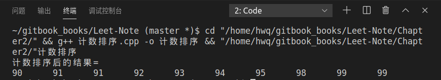
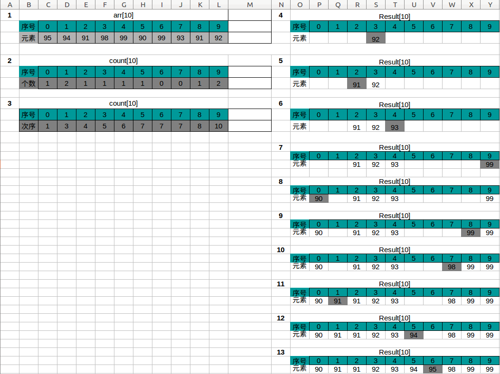

# 计数排序
**问题：**  
实现对数组int arr[10]={95,94,91,98,99,90,99,93,91,92}的计数排序，并画出流程图

**计数排序原理：**  
计数排序是由额外空间的辅助和元素本身的值决定的。计数排序过程中不存在元素之间的比较和交换操作，根据元素本身的值，将每个元素出现的次数记录到辅助空间后，通过对辅助空间内数据的计算，即可确定每一个元素最终的位置。
 * 算法过程
  1. 根据待排序集合中最大元素与最小元素的差值范围，申请额外辅助空间 
  2. 遍历待排序集合，将每一个元素出现的次数记录到元素值对应的辅助空间
  3. 对辅助空间内的数据进行计算，得出每一个元素的正确位置
  4. 将待排序集合的每一个元素移动到计算出的正确位置上，排序完成

**代码如下:**
```cpp
#include <iostream>
#include <new>
using namespace std;

void CountSort(int *arr,int len,int max, int min)
{
    int *count=new int[max-min+1];//计数数组
    int *Result=new int[len];//存放排序后的结果
    int index;
    for (int i =0; i <=max-min; i++){//初始化
        count[i]=0;
    }
    for(int i=0; i<len;i++){//计算arr[i]元素出现的个数
        count[arr[i]-min]++;
    }
    for(int i=1; i<=max-min; i++){
        count[i]+=count[i-1];
    }

    for (int i = len-1; i >= 0; i--){
        index=count[arr[i]-min]-1;
        Result[index]=arr[i];
        count[arr[i]-min]--;
    }
    cout<<"计数排序后的结果= "<<endl;
    for(int i=0;i<len;i++){
        cout<<Result[i]<<'\t';
    }
    
    cout<<endl;
    delete [] count;
    delete [] Result;
}

int main()
{
    int arr[10]={95,94,91,98,99,90,99,93,91,92};//待排数组
    CountSort(arr,10,99,90);//计数排序
}
```
**运行结果：**  


**计数排序流程图**  
　　　　  
**注:** *Result下的深灰色格子代表此次排好序的元素*

**算法复杂度分析:**  
时间复杂度：因为$$k=n$$,所以为$$O(n)$$  
空间复杂度：申请了额外辅助空间，且$$k=n$$,所以为$$O(n)$$

**计数排序与快速排序的区别：**
 1. 计数排序属于线性时间排序，用非比较的操作确定排序顺序；而快速排序是基于元素之间的比较，属于比较排序
 2. 任意一个比较排序算法，在最坏情况下，都需要做 Ω(nlg(n)) 次的比较；而计数排序的运行时间为 Θ(k+n)
 3. 计数排序是一种稳定的排序算法；而快速排序不是
 4. 计数排序算法适合待排序元素在一定范围内，数值比较集中；而快速排序没有这种要求