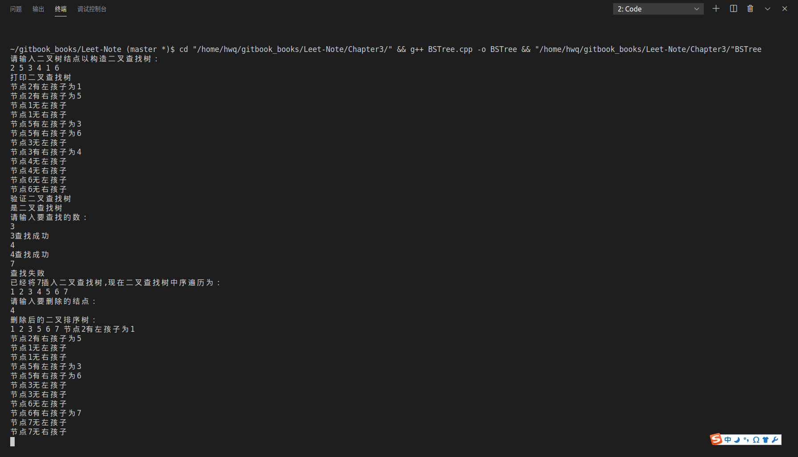

# 二叉查找树 BST (Binary Search Tree)

二叉查找树又称二叉搜索树、二叉排序树,特点如下:
1. 左子树上所有结点值均小于根结点
2. 右子树上所有结点值均大于根结点
3. 结点的左右子树本身又是一颗二叉查找树
4. 二叉查找树中序遍历得到结果是递增排序的结点序列。

## 算法分析

BST的结点结构：
```cpp
//BST结点结构
template<typename T>
class BSTNode{
public:
    T _key; //关键字
    BSTNode *_lchild; //左孩子
    BSTNode *_rchild; //右孩子
    BSTNode *_parent; //父结点
    
    //构造函数
    BSTNode(T key ,BSTNode *lchild,BSTNode *rchild,BSTNode *parent):
    _key(key),_lchild(lchild),_rchild(rchild),_parent(parent) {};
};
```

### 一、 判断是否为二叉查找树
根据第4条性质，可以利用中序遍历得出的结果序列为<font color="red">小->大</font>，来判断是否为二叉查找树
```cpp
template <typename T>
bool BSTree<T>::checkBST(BSTNode<T>* &tree) const
{
	static BSTNode<T> *prev=NULL;
    if(tree != NULL)
    {
        if(!checkBST(tree->_lchild))
            return false;
        if(prev != NULL && tree->_key < prev->_key)
            return false;
        prev = tree;
        if(!checkBST(tree->_rchild))
            return false;
     }
    return true;
}
```
可以看出，采用递归的方式，当前的结点值小于前一个结点的值，就满足性质。否则，判断失败。

### 二、 插入操作

首先创建一个新结点，用于存储关键值。
```cpp
template <typename T>
void BSTree<T>::insert(T key)
{
    //创建一个新的节点，使用构造函数初始化
    BSTNode<T>* z= new BSTNode<T>(key,NULL,NULL,NULL);
    if(!z) //如果创建失败则返回
        return ;
    //调用内部函数进行插入
    insert(_Root,z);
}
```
接着，判断插入值与根结点的大小关系，插入左子树还是右子树。并循环向下查找。
```cpp
//插入操作
//内部使用函数
template<typename T>
void BSTree<T> ::insert(BSTNode<T>* &tree,BSTNode<T>* z)
{
    BSTNode<T>* parent = NULL;
    BSTNode<T>* temp = tree;

    //寻找插入点
    while(temp!=NULL)
    {
        parent= temp;
        if(z->_key > temp->_key)
            temp= temp->_rchild;
        else 
            temp=temp->_lchild;
    }
    z->_parent = parent;
    if(parent==NULL) //如果树本来就是空树，则直接把z结点插入根结点
        tree = z;
    else if(z->_key > parent->_key) //如果z的值大于其双亲，则z为其双亲的右孩子结点
        parent->_rchild = z;
    else                          
        parent->_lchild = z;//否则为其双亲的左孩子结点
}
```

### 三、删除操作

```cpp
template<typename T>
void BSTree<T>::remove(T key)
{
    BSTNode<T> *z, *node; 
    if ((z = search(_Root, key)) != NULL)
        if ( (node = remove(_Root, z)) != NULL)
            delete node;
}
```

### 四、查找操作

外部接口search函数
```cpp
template <typename T>
BSTNode<T> * BSTree<T>::search(T key) 
{
    return search(_Root,key);
}
```
内部调用search函数
```cpp
//非递归实现
//内部使用函数
template <typename T>
BSTNode<T>*  BSTree<T>::search(BSTNode<T>* &tree,T key) const
{
    BSTNode<T>* temp = tree;
    while(temp != NULL)
    {
        if(temp->_key == key)//查找成功
            return temp;
        else if(temp->_key > key)//转向左子树，继续查找
            temp = temp->_lchild;
        else
            temp = temp->_rchild;//转向右子树，继续查找
    }
    return NULL;//查找失败
}
```

### 五、遍历操作

**1. 前序遍历：**

外部preOrder接口
```cpp
template<typename T>
void BSTree<T>::preOrder()
{
    preOrder(_Root);
}
```
内部preOrder接口
```cpp
template<typename T>
void BSTree<T>::preOrder(BSTNode<T>*&tree) const
{
    if(tree)
    {
        cout<<tree->_key<<" ";
        preOrder(tree->_lchild);
        preOrder(tree->_rchild);
    }
}
```

**2. 中序遍历：**

外部inOrder接口
```cpp
template<typename T>
void BSTree<T>::inOrder()
{
    inOrder(_Root);
}
```
内部inOrder接口
```cpp
template <typename T>
void BSTree<T>::inOrder(BSTNode<T>*&tree) const
{
    if(tree)
    {
        inOrder(tree->_lchild);
        cout<<tree->_key<<" ";
        inOrder(tree->_rchild);
    }
}
```

**3. 后序遍历：**

外部postOrder接口
```cpp
template<typename T>
void BSTree<T>::postOrder()
{
    postOrder(_Root);
}
```
内部postOrder接口
```cpp
template <typename T>
void BSTree<T>::postOrder(BSTNode<T>*&tree) const
{
    if(tree)
    {
        postOrder(tree->_lchild);
        postOrder(tree->_rchild);
        cout<<tree->_key<<" ";
    }
}
```

### 六、实验结果

如图：
