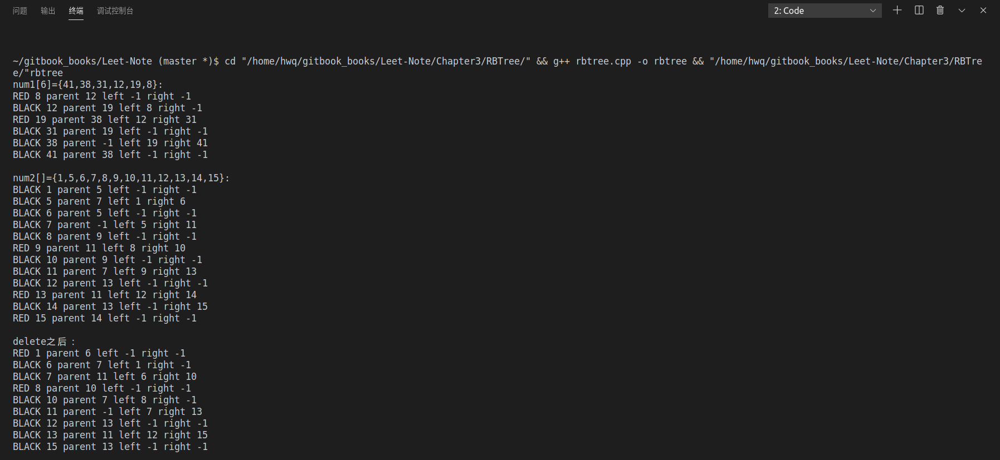

# 红黑树

红黑树中每个结点包含五个域:color,key,left,right 和 p。如果某结点没有一个子结点或父结点,则该域指向 NIL。

一棵二叉树如果满足下面的红黑性质,则为一棵红黑树:

1. 每个结点或是红的,或是黑的。
2. 根结点是黑的。
3. 每个叶结点 (NIL) 是黑的。
4. 如果一个结点是红的,则它的两个儿子都是黑的。
5. 对每个结点,从该结点到其子孙结点的所有路径上包含相同数目的黑结点。

## 算法分析

RBTree的结点结构：
```cpp
class Node {
public:
    int key;//关键字
    Node * p;//父结点
    Node * left;//左子结点
    Node * right;//右子结点
    enum c{RED,BLACK};
    c color;
    Node(int k);
};
```

### 一、 左旋操作
```cpp
void RBTree::LeftRotate(Node * n)
{
    Node * y=n->right;
    n->right=y->left;
    if (y->left!=NIL)
    {
        y->left->p=n;
    }
    y->p=n->p;
    if(n->p==NIL)  root=y;
    else if (n==n->p->left)
    {
        n->p->left=y;
    }
    else  n->p->right=y;
    y->left=n;    
    n->p=y;
}
```

### 二、 右旋操作

```cpp
void RBTree::RightRotate(Node * n)
{
    Node * y=n->left;
    n->left=y->right;
    if (y->right!=NIL)
    {
        y->right->p=n;
    }
    y->p=n->p;
    if(n->p==NIL)  root=y;
    else if (n==n->p->right)
    {
        n->p->right=y;
    }
    else  n->p->left=y;
    y->right=n;    
    n->p=y;
}
```

### 三、查询操作
根据给定的关键字值，查找出某个结点
```cpp
Node * RBTree::Search(int k)
{
    Node * cur=root;
    while(cur->key!=k)
    {
        if(cur->key<k&&cur->right!=NIL)
            cur=cur->right;
        else if (cur->key>k&&cur->left!=NIL)
            cur=cur->left;
        else
            return NIL;
    }
    return cur;

}
```

### 四、插入操作

外部接口Insert函数
```cpp
Node * RBTree::Insert(int k)
{
    Node * cur=root;
    Node * prev=root;
    while(cur!= NIL)
    {
        prev=cur;
        if(k<cur->key)
            cur=cur->left;
        else if (k>cur->key)
            cur=cur->right;
        else
        {
            std::cerr<<std::endl<<k<<" already in RBTree.\n";
            return NIL;
        }
    }
    if(k<prev->key)
    {
        prev->left=new Node(k);
        prev->left->p=prev;
        prev->left->left=prev->left->right=NIL;
        prev->left->color=Node::RED;
        InsertFixup(prev->left);
        return prev->left;
    }
    else if(k>prev->key)
    {
        prev->right=new Node(k);
        prev->right->p=prev;
        prev->right->left=prev->right->right=NIL;
        prev->right->color=Node::RED;
        InsertFixup(prev->right);
        return prev->right;
    }
}
```
内部调用Insert函数，维持红黑树性质
```cpp
void RBTree::InsertFixup(Node * n)
{
    while(n->p->color==Node::RED)
    {
        if(n->p==n->p->p->left)
        {
            Node * uncle=n->p->p->right;
            if(uncle->color==Node::RED)
            {
                n->p->color=uncle->color=Node::BLACK;
                n->p->p->color=Node::RED;
                n=n->p->p;
            }
            else if(uncle->color==Node::BLACK&&n==n->p->right)
            {
                n=n->p;
                LeftRotate(n);
            }
            else if(uncle->color==Node::BLACK&&n==n->p->left)
            {
                n->p->color=Node::BLACK;
                n->p->p->color=Node::RED;
                RightRotate(n->p->p);
            }
        }
        else if (n->p==n->p->p->right)
        {
            Node * uncle=n->p->p->left;
            if(uncle->color==Node::RED)
            {
                n->p->color=uncle->color=Node::BLACK;
                n->p->p->color=Node::RED;
                n=n->p->p;
            }
            else if(uncle->color==Node::BLACK&&n==n->p->left)
            {
                n=n->p;
                RightRotate(n);
            }
            else if(uncle->color==Node::BLACK&&n==n->p->right)
            {
                n->p->color=Node::BLACK;
                n->p->p->color=Node::RED;
                LeftRotate(n->p->p);
            }
        }
    }
    root->color=Node::BLACK;
}
```

### 五、删除操作


外部delete接口
```cpp
bool RBTree::Delete(int k)
{
    Node * x;
    Node * z=Search(k);
    Node * y=z;
    Node::c y_original_color=y->color;//of toReplace
    if(z->left==NIL)
    {
        x=z->right;
        TransPlant(z,z->right);
    }
    else if(z->right==NIL)
    {
        x=z->left;
        TransPlant(z,z->left);
    }
    else
    {
        y=Minimum(z->right);
        y_original_color=y->color;
        x=y->right;
        if(y->p==z) x->p=y;
        else
        {
            TransPlant(y,y->right);
            y->right=z->right;
            y->right->p=y;
        }
        TransPlant(z,y);
        y->left=z->left;
        y->left->p=y;
        y->color=z->color;
    }

    if(y_original_color==Node::BLACK)
        DeleteFixup(x);
}
```
内部delete接口，维持红黑树性质
```cpp
void RBTree::DeleteFixup(Node *n) 
{
    Node *brother;
    while (n->color == Node::BLACK && n != root) {
        if (n == n->p->left) {
                brother = n->p->right;
                if (brother->color == Node::RED) {
                    n->p->color = Node::RED;
                    brother->color = Node::BLACK;
                    LeftRotate(n->p);
                    brother = n->p->right;
                } 
                if (brother->left->color == Node::BLACK && brother->right->color == Node::BLACK) {
                    brother->color = Node::RED;
                    n = n->p;
                } else if (brother->right->color == Node::BLACK) {
                    brother->color = Node::RED;
                    brother->left->color = Node::BLACK;
                    RightRotate(brother);
                    brother=n->p->right;
                }else
                {
                    brother->color=n->p->color;
                    n->p->color=Node::BLACK;
                    brother->right->color=Node::BLACK;
                    LeftRotate(n->p);
                    n=root;
                }
                 


        }
        else {
                brother = n->p->left;
                if (brother->color == Node::RED) {
                    n->p->color = Node::RED;
                    brother->color = Node::BLACK;
                    LeftRotate(n->p);
                    brother = n->p->left;
                } 
                if (brother->right->color == Node::BLACK && brother->left->color == Node::BLACK) {
                    brother->color = Node::RED;
                    n = n->p;
                } else if (brother->left->color == Node::BLACK) {
                    brother->color = Node::RED;
                    brother->right->color = Node::BLACK;
                    LeftRotate(brother);
                    brother=n->p->left;
                }else
                {
                    brother->color=n->p->color;
                    n->p->color=Node::BLACK;
                    brother->left->color=Node::BLACK;
                    RightRotate(n->p);
                    n=root;
                }
                

        }
    }
    n->color = Node::BLACK;
}
```

### 六、实验结果

main函数：
```cpp
int main() {
    int num1[6]={41,38,31,12,19,8};
    int num2[]={1,5,6,7,8,9,10,11,12,13,14,15};
    int num3[3]={14,9,5};
    Node * root1=new Node(num1[0]);
    Node * root2=new Node(num2[0]);
    RBTree tree1(root1);
    RBTree tree2(root2);

    std::cout<<"num1[6]={41,38,31,12,19,8}: "<<std::endl;
    for(int i=1;i<6;i++)
     {
         tree1.Insert(num1[i]);
     }

    tree1.InorderTreeWalk(tree1.root);
    std::cout<<std::endl;

    std::cout<<"num2[]={1,5,6,7,8,9,10,11,12,13,14,15}: "<<std::endl;
    for(int i=1;i<12;i++)
     {
         tree2.Insert(num2[i]);
     }

    tree2.InorderTreeWalk(tree2.root);
    std::cout<<std::endl;
    
    std::cout<<"delete之后： "<<std::endl;
     for(int i=0;i<3;i++)
      {
          tree2.Delete(num3[i]);
      }
// tree2.Delete(num3[1]);
// tree2.Delete(num3[2]);
     tree2.InorderTreeWalk(tree2.root);
     std::cout<<std::endl;
    return 0;
}
```
如图：
