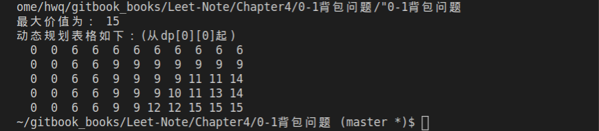

# 0-1背包问题


## 一、实验原理

1. 背包问题

  背包问题已经是一个很经典而且讨论很广泛的算法问题了。  
  背包问题泛指这类种问题:给定一组有固定价值和固定重量的物品,以及一个已知最大承重量的背包,求在不超过背包最大承重量的前提下,能放进背包里面的物品的最大总价值。

2. 0-1背包问题


  问题描述:有编号分别为 a,b,c,d,e 的五件物品,它们的重量分别是 2,2,6,5,4,它们的价值分别是 6,3,5,4,6,每件物品数量只有一个。现在给你一个承重为 10 的背包,如何让背包里装入的物品具有最大的价值总和?  
  **特点:每个物品只有一件,选择放或者不放。**

## 二、实验要求

算法设计:

输入物品数 n,背包容量 c,输入 n 个物品的重量、价值,在以上算法中任选两个实现最优解决 0-1 背包问题。

请问:所选算法的实现流程图或者伪代码是什么?比较时间复杂度和空间复杂度,得出什么结论?

## 三、算法分析

### 1、动态规划方法解决 0-1 背包问题:

步骤 1-找子问题:  
子问题必然是和物品有关的,对于每一个物品,有两种结果:能装下或者不能装下。  
第一,包的容量比物品体积小,装不下,这时的最大价值和前 i-1 个物品的最大价值是一样的。  
第二,还有足够的容量装下该物品,但是装了不一定大于当前相同体积的最优价值,所以要进行比较。  
由上述分析,子问题中物品数和背包容量都应当作为变量。
因此子问题确定为背包容量为 j 时,求前 i 个物品所能达到最大价值。

步骤 2-确定状态:  
由上述分析,“状态”对应的“值”即为背包容量为 j 时,求前 i 个物品所能达到最大价值,设为 $$dp[i][j]$$。初始时,$$dp[0][j]$$(0<=j<=V)为 0,因为没有物品也就没有价值。

步骤 3-确定状态转移方程:  
由上述分析,第 i 个物品的体积为 w,价值为 v,则状态转
移方程为
```cpp
w>j: dp[i][j] = dp[i - 1][j];//若背包装不下该物品，则最大价值不变
//不放入物品时达到的最大价值&放入该物品时达到的最大价值进行比较，取最大值
w<=j: dp[i][j] = max(dp[i][j], v[i] + dp[i - 1][j - w[i]]);
```
0-1背包问题算法代码如下：
```cpp
#include <iostream>
#include <algorithm>
#include <vector>
#include <iomanip>

using namespace std;

//物品数量
#define NUM  5
//背包容量
#define CAP  10

class KnapSack{
  public:
    int knapSack(int w[], int v[],const int size,const int C) {
        if (size == 0) {
            return 0;
        }

        dp.resize(size);
        for (int i =0 ; i < dp.size(); i++)
        {
          dp[i].resize(C+1);
        }
        //初始化第零行
        //仅考虑容量为C的背包放第0个物品的情况
        for (int i = 0; i < C+1; i++) {
            dp[0][i] = w[0] <= i ? v[0] : 0;
        }
		//填充其他行和列
        for (int i = 1; i < size; i++) {
            for (int j = 0; j < C+1; j++) {
                dp[i][j] = dp[i - 1][j];//若背包装不下该物品，则最大价值不变
                if (w[i] <= j) {
					//不放入物品时达到的最大价值&放入该物品时达到的最大价值进行比较，取最大值
                    dp[i][j] = max(dp[i][j], v[i] + dp[i - 1][j - w[i]]);
                }
            }
        }
        return dp[size - 1][C];
    }

// private:
	vector<vector<int> > dp;
};

int main() 
{
	int w[NUM]={2,2,6,5,4};//重量
	int v[NUM]={6,3,5,4,6};//价值
	KnapSack  kp;
	cout<<"最大价值为： "<<kp.knapSack(w,v,NUM,CAP)<<endl;
	cout<<"动态规划表格如下：(从dp[0][0]起)"<<endl;
	for(int i=0;i<kp.dp.size();i++){
		for(int j=0;j<kp.dp[0].size();j++){
			cout<<setw(3)<<kp.dp[i][j];
		}
		cout<<endl;
	}
}
```
运行结果如图：  



### 2、回溯法解决 0-1 背包问题:

回溯法先确定解空间的结构,使用深度优先搜索,搜索路径一般沿树形结构进行,在搜
索过程中,首先会判断所搜索的树结点是否包含问题的解,如果肯定不包含,则不再搜索以
该结点为根的树结点,而向其祖先结点回溯;否则进入该子树,继续按深度优先策略搜索。
运用回溯法解题通常包含以下三个步骤:
1. 针对所给问题,定义问题的解空间;
2. 确定易于搜索的解空间结构;
3. 以深度优先的方式搜索解空间,并且在搜索过程中用剪枝函数避免无效搜索;

对于有n种可选物品的0-1背包问题，其解空间由长度为n的0-1向量组成,可用子集数表示。在搜索解空间树时，只要其左儿子结点是一个可行结点，搜索就进入左子树。当右子树中有可能包含最优解时就进入右子树搜索。

```cpp
#include <iostream>
#include <cstdio>
#include <string.h>
#include <algorithm>

using namespace std;

#define N 100

struct Goods{
int wight;//物品重量
int value;//物品价值
};

int n,bestValue,cv,cw,C;//物品数量，价值最大，当前价值，当前重量，背包容量
int X[N],cx[N];//最终存储状态，当前存储状态
struct Goods goods[N];

int BackTrack(int i){
    if(i > n-1){
        if(bestValue < cv){
            for(int k = 0; k < n; k++)
                X[k] = cx[k];//存储最优路径
            bestValue = cv;
        }
        return bestValue;
    }
    if(cw + goods[i].wight <= C){//进入左子树
        cw += goods[i].wight;
        cv += goods[i].value;
        cx[i] = 1;//装入背包
        BackTrack(i+1);
        cw -= goods[i].wight;
        cv -= goods[i].value;//回溯，进入右子树
    }
    cx[i] = 0;//不装入背包
    BackTrack(i+1);
    return bestValue;
}

bool m(struct Goods a, struct Goods b){
    return (a.value/a.wight) > (b.value/b.wight);
}

int KnapSack3(int n, struct Goods a[], int C,int x[]){
    memset(x,0,sizeof(x));
    sort(a,a+n,m);//将各物品按单位重量价值降序排列
    BackTrack(0);
    return bestValue;
}
int main()
{
    printf("物品种类n：");
    scanf("%d",&n);
    printf("背包容量C：");
    scanf("%d",&C);
    for(int i = 0; i < n; i++){
        printf("物品%d的重量w[%d]及其价值v[%d]：",i+1,i+1,i+1);
        scanf("%d%d",&goods[i].wight,&goods[i].value);
    }
    int sum3 = KnapSack3(n,goods,C,X);
    cout<<"回溯法求解0/1背包问题:\nX=[";
    for(int i = 0; i < n; i++)
        cout << X[i] <<" ";//输出所求X[n]矩阵
	cout<<"]   装入总价值"<<sum3<<endl;
	cout<<"排序后的物品价值数组是：\nvalue=[";
    for(int i = 0; i < n; i++)
        cout<<goods[i].value<<" "; 
	cout<<"]"<<endl;  
	cout<<"排序后的物品重量数组是：\nweight=[";	 
    for(int i = 0; i < n; i++)
        cout<<goods[i].wight<<" ";   
	cout<<"]"<<endl;
    return 0;
}
```

## 四、比较和分析

1. 动态规划方法的时间复杂度为$$O(n*C)$$,空间复杂度为$$O(n*C)$$
2. 回溯法的时间复杂度为$$O(2*n)$$,空点复杂度为$$O(n)$$
3. 通过比较时间复杂度可知，回溯法有重复计算的问题，动态规划在0-1背包问题中有最优子结构。所以对于0-1背包问题，动态规划优于回溯法。