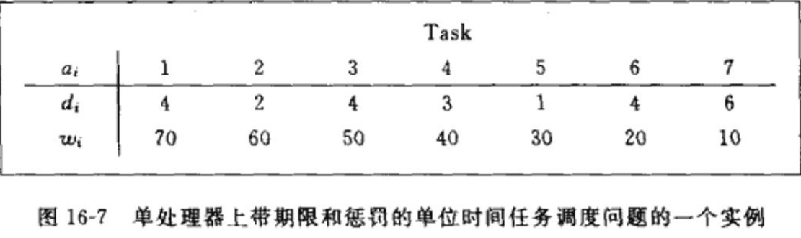
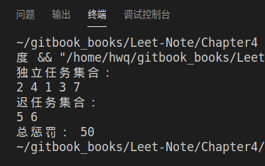
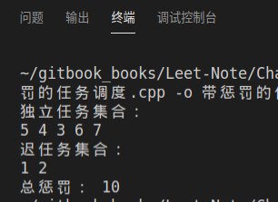

# 具有期限和惩罚的单位时间任务调度

## 一、实验原理(详细请参考课本第 16 章)
1. 活动选择问题:
对几个互相竞争的活动进行调度,它们都要求以独占的方式使用某一公共资
源。而在同一时间内只有一个活动能使用这一资源。假设有一个需要使用某一资
源的 n 个活动组成的集合 S={a1,a2,a3,...,an}。每个活动 ai 都有一个要求使用该资源的起始时间 si 和一个结束时间 fi,且 si <fi。如果选择了活动 i,则它在半开时间
区间[si, fi)内占用资源。若区间[si, fi)与区间[sj, fj)不相交,则称活动 i 与活动 j 是兼容的。  
活动选择问题就是要选择出一个由互不兼容的问题组成的最大子集合。

2. 贪心策略  
动态规划是贪心算法的基础。  
贪心算法即通过做一系列的选择来给出某一问题的最优解。对算法中的每一
个决策点,做一个当时最佳的选择。  
* 贪心算法的使用条件:贪心选择性质和最优子结构是两个关键的特点。如果
我们能够证明问题具有这些性质,那么就可以设计出它的一个贪心算法。
 * 贪心选择性质:一个全局最优解可以通过局部最优(贪心)选择来达到。
 * 最优子结构:对一个问题来说,如果它的一个最优解包含了其子问题的
最优解,则称该问题具有最优子结构。
* 贪心算法的基本思路:
 * 建立对问题精确描述的数学模型,包括定义最优解的模型;
 * 将问题分解为一系列子问题,同时定义子问题的最优解结构;
 * 应用贪心原则确定每个子问题的局部最优解,并根据最优解的模型,用
子问题的局部最优解堆叠出全局最优解。


## 二、实验要求
实现一个任务调度问题(课本 P241):在单处理器上具有期限和惩罚的单位时
间任务调度
1. 实现这个问题的贪心算法,并写出流程图或者伪代码。
2. 将每个 Wi 替换为 max{W1,W2......Wn}-Wi 运行算法、比较并分析结果。




## 三、算法分析

任务的结构：
```cpp
typedef struct TASK{	
	int id;//任务标号
	int deadline;//截止时间
	int w;//超时惩罚
}TASK;
```
具有期限和惩罚的单位时间任务调度算法：
```cpp
bool scheduleable(vector<TASK> &ref_task) //A是活动截止时间的集合，t是一个任务的截止时间，加入t后如果A中的所有元素都不会任务延迟，则认为A是独立的，返回真，可加 
{
	int w_sum=0;//最优调度下的总惩罚时间 
	vector<TASK> Sche_List;//独立任务集合
	vector<TASK> LateTask_list;
	if(Sche_List.empty()) Sche_List.push_back(ref_task[0]);
	int cnt=0;//迟任务数
	for(int i=1;i<Max;i++){//循环扫描任务列表，确定独立任务集合

		Sche_List.push_back(ref_task[i]);
		sort(Sche_List.begin(),Sche_List.end(),a_less_b);//按照截止时间升序排序
		for(int k=0;k!=Sche_List.size();k++){
			int temp=i-cnt;
			if(k+1>Sche_List[k].deadline){//任务完成时间是否在截止时间之前
				int min_w=Sche_List[i-cnt].w;
				for(int j=0;j!=Sche_List.size();j++){//找出最小惩罚
					if (Sche_List[j].w<min_w){
						min_w=Sche_List[j].w;
						temp=j;
					}
				}
				w_sum+=min_w;//总惩罚
				cnt++;//迟任务数	
				LateTask_list.push_back(*(Sche_List.begin()+temp));//迟任务集合			
				Sche_List.erase(Sche_List.begin()+temp);//删除最小惩罚的任务
				break;//因为每轮循环只有一个任务可能会被惩罚，所以找到之后，就可以退出本次循环，继续进行下次循环了
			}
		}
	}
	cout<<"独立任务集合： "<<endl;
	for(vector<TASK>::iterator it=Sche_List.begin();it!=Sche_List.end();it++)
		cout<<it->id<<" ";//在A集合中元素的调度方案，被拒绝的顺序任意 
	cout<<endl;
	cout<<"迟任务集合： "<<endl;
	for(vector<TASK>::iterator it=LateTask_list.begin();it!=LateTask_list.end();it++)
		cout<<it->id<<' ';
	cout<<endl;
	cout<<"总惩罚： "<<w_sum<<endl;
	return true;
}
```

### 1. 实现这个问题的贪心算法

w[7]={70,60,50,40,30,20,10}

main函数：
```cpp
int main()
{
	TASK  arr[7]={
		{1,4,70},
		{2,2,60},
		{3,4,50},
		{4,3,40},
		{5,1,30},
		{6,4,20},
		{7,6,10},
	};
	vector<TASK> task(arr,arr+Max);
	scheduleable(task);
}
```
如图：



### 2. 将每个 Wi 替换为 max{W1,W2......Wn} — Wi ，运行算法、比较并分析结果

w[7]={0,10,20,30,40,50,60}

main函数：
```cpp
int main()
{
	TASK  arr[7]={
		{1,4,0},
		{2,2,10},
		{3,4,20},
		{4,3,30},
		{5,1,40},
		{6,4,50},
		{7,6,60},
	};
	vector<TASK> task(arr,arr+Max);
	scheduleable(task);
}
```
如图：



比较和分析：
1. 通过比较运行结果，独立任务集合受任务的超时惩罚的影响
2. 每次寻找的都是最小化迟任务的总超时惩罚，最大化早任务的总超时惩罚